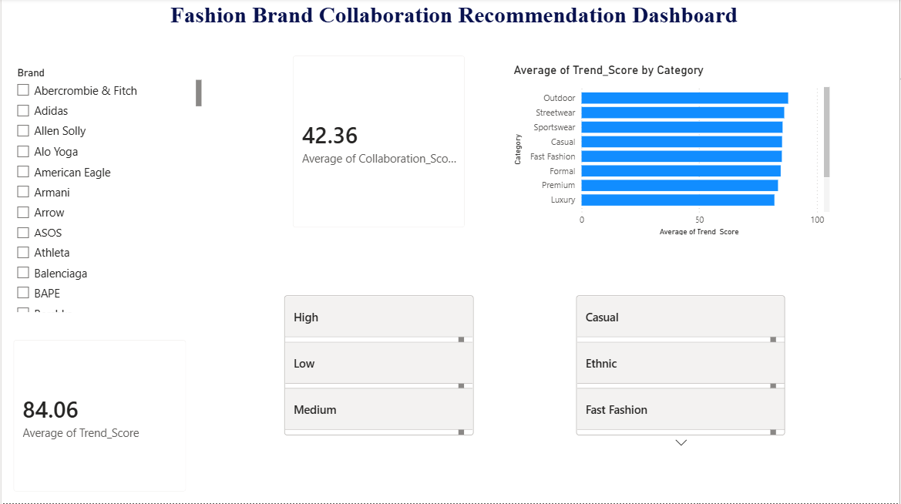
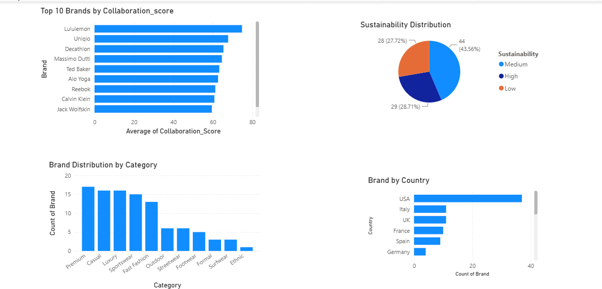

#  Fashion Brand Collaboration Recommendation System

##  Project Overview

The Fashion Brand Collaboration Recommendation System is an end-to-end data analytics project that helps identify potential collaboration opportunities between fashion brands using data analysis and a recommendation engine.

The project includes data collection, preprocessing, exploratory data analysis (EDA), feature engineering, recommendation generation, and an interactive Power BI dashboard.

---

## Business Problem

Fashion brands often struggle to identify suitable collaboration partners that align with their audience, market trends, and sustainability goals.

This project helps analyze brand characteristics and recommend potential collaborations using data analytics and machine learning techniques.

---

##  Features

- Data Cleaning and Preprocessing
- Exploratory Data Analysis (EDA)
- Feature Engineering
- Brand Recommendation using Cosine Similarity
- Interactive Power BI Dashboard
- Data Visualization using Matplotlib & Seaborn

---

##  Technologies Used

- Python
- Jupyter Notebook
- Pandas
- NumPy
- Matplotlib
- Seaborn
- Scikit-learn
- Power BI
- Microsoft Excel

---

## Project Workflow

 Data Collection
      ↓
 Data Cleaning
      ↓
 Exploratory Data Analysis
      ↓
 Feature Engineering
      ↓
 Recommendation System
      ↓
 Power BI Dashboard
      ↓
 Business Insights

 ---

##  Project Structure

```
Fashion-Brand-Collaboration-Recommendation-System
│
├── Dataset
├── Notebooks
├── Dashboard
├── Images
├── README.md
├── requirements.txt
└── .gitignore
```

---

## 📊 Dashboard Preview

### Main Dashboard



### Dashboard Insights



---

##  Key Insights

- Identified top trending fashion brands.
- Calculated collaboration scores for brand partnerships.
- Analyzed sustainability distribution across brands.
- Compared fashion categories using trend scores.
- Developed a recommendation engine based on brand similarity.

---

##  Future Enhancements

- Deploy as a web application using Streamlit.
- Integrate real-time fashion brand data through APIs.
- Improve recommendations using hybrid recommendation techniques.
- Add sentiment analysis from social media data.

---

##  Contact

**Developed by:** Rishika Upadhyay

GitHub: https://github.com/rishika-upadhyay

LinkedIn: https://www.linkedin.com/in/rishika-upadhyay-856401326?utm_source=share_via&utm_content=profile&utm_medium=member_android
